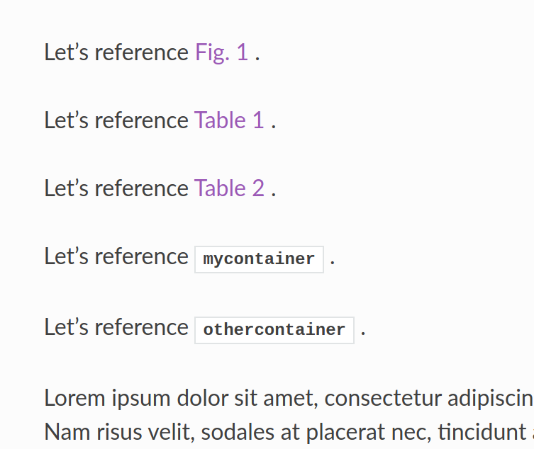
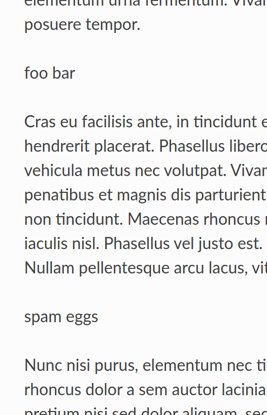

Install with:  ::

   poetry install

Then run the build: ::

   poetry run sphinx-build -E -b html  docs dist/docs -v

Gives this message:   ::

  sphinx-demo/docs/index.rst:14: WARNING: undefined label: mycontainer
  sphinx-demo/docs/index.rst:16: WARNING: undefined label: othercontainer

Examine the files in ``dist/docs/index.html``.

The behavior I want is for the referenced text to be hyperlinked "Cont. 1" instead of the
monospace without link.

Also, at the actual container, the container number should appear instead of just the
content.

